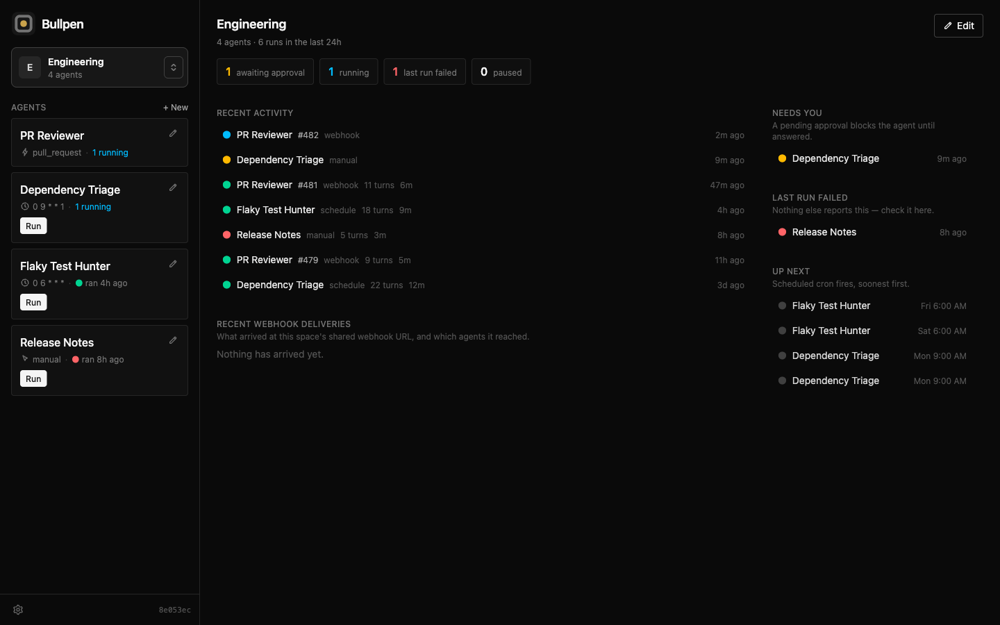
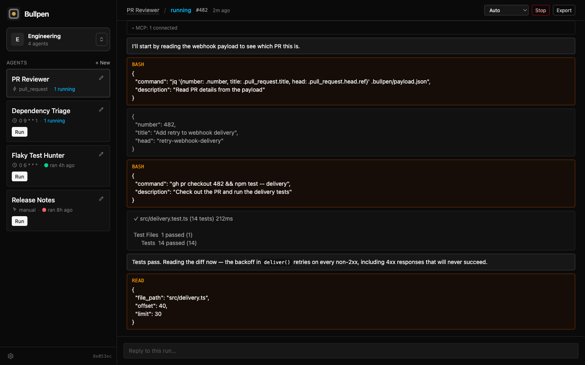

# Bullpen

A self-hosted dashboard for a roster of Claude Code agents — code agents that clone a repo and
open a PR, and non-code agents that fetch data and report back. Run them by hand, on a cron, or
from a webhook, and watch them work.  **[Using bullpen](docs/README.md)** covers setting agents up: workspaces, permission modes,
webhooks, env and secrets, MCP servers, and email.


Agents run through [`@anthropic-ai/claude-agent-sdk`](https://code.claude.com/docs/en/agent-sdk),
which drives the real `claude` binary, so a Claude subscription works without an API key.





## Run it locally

Needs Node 22.16+. If you already use Claude Code on your local machine, your existing authentication and configuration should be picked up automatically.

```bash
npm install
npm run dev
```

Then open **http://localhost:5173**. That starts the API on `:4322` and Vite on `:5173`
with hot reload, proxying `/api` and `/ws` to the server.

To run it the way the container does — one process, one port, no Vite:

```bash
npm run build && npm start
```

Then open **http://localhost:4322**.

Nothing needs configuring for either. Optional settings go in a repo-root `.env`, which both
read if it exists — see [`.env.example`](.env.example).

Other useful commands:

- `npm test`
- `npm run typecheck`

## Standalone mode

By default bullpen uses your own Claude config, `~/.claude` — your login, skills, and MCP
servers — and only ever reads it. On the machine where you already use Claude Code, that means
there is nothing to set up.

Set **`CLAUDE_CONFIG_DIR`** and bullpen runs in standalone mode: that directory is bullpen's to
own and write. The Docker image sets `CLAUDE_CONFIG_DIR=/data/claude`, which is what makes a
deployed box standalone. It is a property of the config dir, not of the machine or the OS — the
same build runs either way.

To try it locally without touching your own `~/.claude`, run `npm run dev:standalone`. That uses
a throwaway `~/.bullpen-standalone/` with its own database and config dir, so it starts at
onboarding and needs a `claude setup-token`. It keeps its state between runs;
`npm run dev:standalone:fresh` wipes it and starts over. Stop it and run `npm run dev` to be back
on your real data.

### Behavior differences

| | Default | Standalone |
|---|---|---|
| Config dir | `~/.claude` | `/data/claude` (or whatever you set) |
| Settings → Skills | read-only | clone or replace the skills repo, with a **Pull latest** button |
| Skills `git pull` on boot | no — default mode doesn't assume it's a git checkout | yes, every boot |
| Global `CLAUDE.md` | read-only | editable |
| Shared MCP servers | read-only | editable, with a suggested-server catalog |
| Onboarding MCP step | skipped | shown |
| Credential | your existing login | `claude setup-token`, or an API key |

### Claude credentials

In standalone mode, the dashboard opens a setup screen while no credential is configured. It asks
for a Claude token (run `claude setup-token` on any logged-in machine), an optional GitHub token,
and your skills repo, and saves them to global env. Open **`/?setup=1`** to walk through it again —
whatever you enter replaces the saved value, and a skipped step leaves it as it is.

Instead of the setup screen, you can:

- Put `CLAUDE_CODE_OAUTH_TOKEN` or `ANTHROPIC_API_KEY` in `.env` (mode 600), or add an API key
  under Settings → Global environment.
- Run `claude login` inside the container (with Kamal, `kamal app exec -i --reuse 'claude login'`),
  which writes `.credentials.json` into the config dir.

When more than one is set, a value in the dashboard's global env wins over `.env`, and either
wins over a `claude login`. `GET /api/health` reports which one is in force.

## Deploying to a server

Deploys are handled by [Kamal 2](https://kamal-deploy.org): one Linux server, one container,
with the image built by CI rather than on your machine or the server.

### First deploy

After the CI build has run successfully on `HEAD` at least once, determine the following variables:

| Variable | What it is |
|---|---|
| `BULLPEN_HOST` | The server's IP or hostname. Required. |
| `BULLPEN_TZ` | The container's timezone. Defaults to `UTC`. |
| `GITHUB_TOKEN` | Only for pulling the image from ghcr, so it needs `read:packages`. |
| `TS_HOSTNAME` | Tailscale only: the node name, so the dashboard is `https://<node>.<tailnet>.ts.net`. Defaults to `bullpen`. |
| `TS_AUTHKEY` | Tailscale only: an auth key, used once. |

Then run:

```bash
gem install kamal
export BULLPEN_HOST=203.0.113.10       # the server
export BULLPEN_TZ=America/New_York     # optional, defaults to UTC
export GITHUB_TOKEN=ghp_…              # needs read:packages, to pull the image
export TS_HOSTNAME=bullpen             # the Tailscale node name
export TS_AUTHKEY=tskey-auth-…         # optional, only for Tailscale
npm run deploy:setup                   # installs Docker, starts the app and accessories
```

Then open a tunnel with `ssh -N -L 4322:127.0.0.1:4322 root@$BULLPEN_HOST` and go to
**http://localhost:4322**. The setup screen asks for your Claude token, and that's it.

### Reaching the dashboard

**The dashboard has no login/authentication**, so the container publishes no port of its own. There are two ways
to reach it:

- **SSH tunnel** (always there). The `tunnel` accessory listens on the server's loopback, and
  `ssh -N -L 4322:127.0.0.1:4322 <user>@<host>` puts the dashboard at `http://localhost:4322`.
  This needs nothing beyond SSH, but webhooks can't reach it.
- **Tailscale** (optional). The `tailscale` accessory serves the dashboard to your tailnet on
  443 and funnels only `/api/hooks` to the internet on 8443, so webhook senders can reach the
  server and nothing else is public. To expose bullpen some other way, replace this accessory
  in `config/deploy.yml` with your own proxy.

With Tailscale the dashboard is at `https://<node>.<tailnet>.ts.net`. Funnel needs the `funnel`
attribute in your tailnet policy, and the tailnet's ACL must let your devices reach each other
(`{"src": ["autogroup:member"], "dst": ["autogroup:self:*"]}` if it doesn't). To add it after the
first deploy, export `TS_AUTHKEY` and run `kamal accessory reboot tailscale`.

### Deploying from CI

Every deploy after the first is a push to `main`. The `build` workflow pushes the image; the
`deploy` workflow runs Kamal for that sha. To let it reach the server, run this in the shell
you did the first deploy from, so the variables exported there carry over:

```bash
gh secret set BULLPEN_HOST --body "$BULLPEN_HOST"
gh secret set KAMAL_HOST_KEY --body "$(ssh-keyscan -t ed25519 "$BULLPEN_HOST")"
ssh-keygen -t ed25519 -N '' -C bullpen-deploy -f ~/.ssh/bullpen_deploy   # a key CI uses for nothing else
ssh-copy-id -i ~/.ssh/bullpen_deploy.pub root@"$BULLPEN_HOST"
gh secret set KAMAL_SSH_KEY < ~/.ssh/bullpen_deploy
[ -n "$BULLPEN_TZ" ] && gh variable set BULLPEN_TZ --body "$BULLPEN_TZ"
[ -n "$TS_HOSTNAME" ] && gh secret set TS_HOSTNAME --body "$TS_HOSTNAME"
```

`GITHUB_TOKEN` needs nothing: the job's own token can pull this repo's image. `TS_AUTHKEY`
isn't needed either, since a deploy never boots the Tailscale accessory. `BULLPEN_TZ` is a
variable; the rest are secrets because an Actions log masks a secret's value wherever it
appears, and a public repo's logs are public.

To redeploy an older commit, run the workflow by hand with its sha; `npm run deploy` does the
same from your machine, with the variables above exported.

Nothing is ever built on your machine or the server — `better-sqlite3` compiles from source and
a small server hasn't the memory. A deploy stops the old container (waiting for running agents)
and starts the new one, so it costs a few seconds of downtime.

**Webhooks** need a public route to `/api/hooks`. With Tailscale that is
`https://<node>.<tailnet>.ts.net:8443/api/hooks/...`; the dashboard shows the right URL.

**Afterwards:** `kamal app logs -f` and `kamal app details`.

## Layout

| Path | What |
|---|---|
| `packages/server` | Hono API, WebSocket, SQLite, the Agent SDK runner |
| `packages/web` | React SPA |